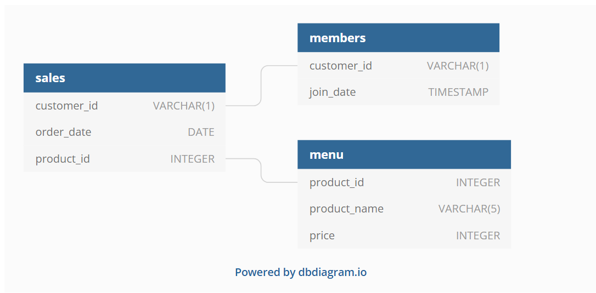

# Eight Week SQL Challenge

## Danny's Diner
[Case Study #1 - Danny's Diner](https://8weeksqlchallenge.com/case-study-1/)

[Answers](https://medium.com/analytics-vidhya/8-week-sql-challenge-case-study-week-1-dannys-diner-2ba026c897ab)


### 1. What is the total amount each customer spent at the restaurant?
```sql
SELECT customer_id, sum(price) AS total_sales
	FROM sales
	JOIN menu
	on sales.product_id = menu.product_id
	GROUP BY customer_id;
```

### 2.  How many days has each customer visited the restaurant?

```sql
SELECT customer_id, count(DISTINCT(order_date)) AS num_visits
	FROM sales
	GROUP BY customer_id;
```

### 3. What was the first item from the menu purchased by each customer?

```sql
SELECT customer_id, product_name
	FROM sales s
	JOIN menu m
	ON s.product_id = m.product_id
	GROUP BY customer_id
	ORDER BY order_date;
```
The answers online all had the DENSE RANK formulation which I hadn't learned yet. Here I'm missing that one customer order two things on the first day. But I think this was actually what the question was looking for. It's the first module, after all.

### 4. What is the most purchased item on the menu and how many times was it purchased by all customers?

```sql
SELECT customer_id, 
    (SELECT m.product_id
        FROM sales s
        JOIN menu m
        ON s.product_id = m.product_id
        GROUP BY m.product_id
        ORDER BY COUNT(s.product_id) DESC 
        LIMIT 1) AS most_popular 
    FROM sales s
    JOIN menu m
    ON s.product_id = m.product_id
    GROUP BY customer_id
```
This one isn't quite right either. But it tells you the most popular dish is ramen